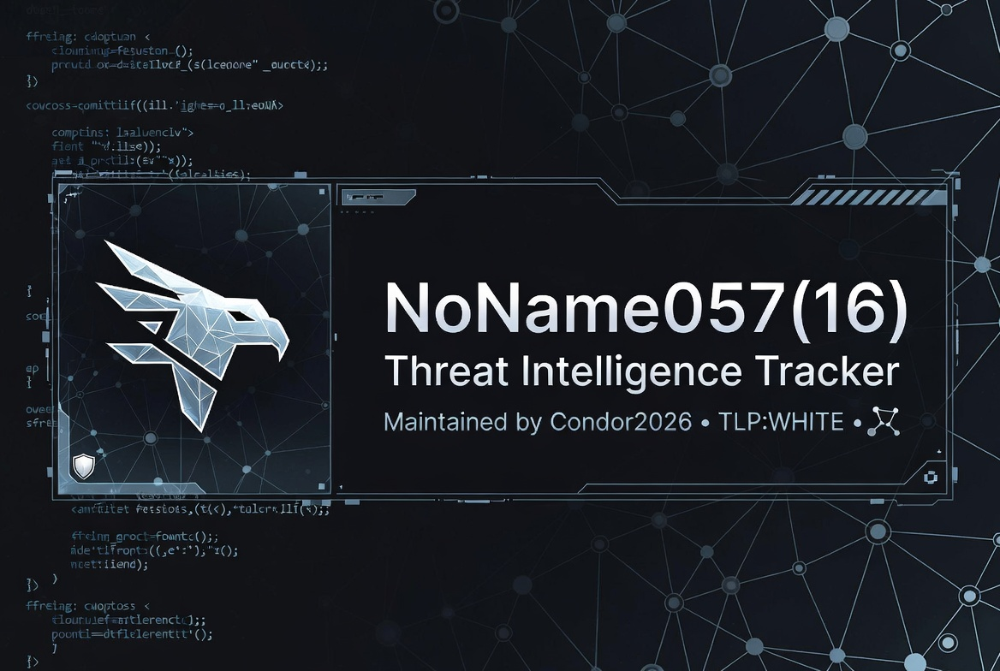

# 🕵️ NoName057(16) - Threat Intelligence Tracker

**Repository Purpose:** Centralized Mapping & Tracking of the NoName057(16) Threat Actor Infrastructure  
**Classification:** TLP:WHITE  
**Status:** 🟢 Active Tracking (Updated: 2026-07-25)  

---

## 📖 Introduction

This repository serves as a **public, structured threat intelligence tracker** for the cybercriminal and hacktivist group tracked as **NoName057(16)** (also associated with the **GreenSnow botnet**, **Emotet** syndicate, and **Killnet/Conti** tactical alliances).

The goal is to provide defenders, researchers, and incident responders with a **single source of truth** regarding this actor's infrastructure, malware payloads, tactics, techniques, and procedures (TTPs), and real-time operational telemetry.

*This is not a "doxxing" or offensive operations project. It is a defensive intelligence repository built for detection, prevention, and mitigation.*

---

## 🎯 Scope of Mapping

This repository will systematically map and document the following aspects of NoName057(16) operations:

### 1. Infrastructure (Network Topology)
- **Primary C2 Nodes:** IP addresses, ASNs (e.g., `AS210558`), and geolocation.
- **DNS Abuse:** Tracking the use of dynamic DNS services (specifically the massive abuse of `sslip.io`) and custom domain clusters (e.g., `d3d97e...com`).
- **Bulletproof Hosting:** Providers enabling the group's persistence (e.g., 1337 Services GmbH).
- **Fast-Flux Networks:** Subdomain generation algorithms and patterns used to evade blocklists.

### 2. Malware Arsenal (Payloads & Droppers)
- **Dropper Campaigns:** Excel (.xls / .xlsx) documents used as initial infection vectors (spear-phishing).
- **Core Payloads:** Banking trojans (Emotet / Dridex), loaders, and secondary stages.
- **Post-Exploitation Tools:** RATs (XWorm, SectopRAT, Quasar, NjRAT), stealer malware (Redline), and ransomware precursors.
- **File Hashes:** SHA256, MD5, and SHA1 of all identified malicious samples.

### 3. Telemetry & Operational Activity
- **Botnet Sizing:** Active bot counts, geographic distribution of compromised hosts (zombies).
- **DDoS Warm-up Analysis:** Monitoring baseline activity to predict imminent DDoS waves (coordinated with groups like Anon Sudan and Killnet).
- **Temporal Tracking:** Historical sighting volumes (daily, monthly, total) to identify infrastructure rotations.

### 4. TTPs & Campaign Correlation
- **MITRE ATT&CK Mapping:** Mapping observed behaviors to the MITRE framework.
- **Cross-Group Links:** Identifying overlaps with other threat clusters (Killnet, Conti, ITArmy, etc.).
- **Vulnerability Exploitation:** Tracking which CVEs the group is actively weaponizing (e.g., Fortinet SSL-VPN CVEs).

---

## 📂 Repository Structure

```
/
├── reports/                 # Full threat intelligence reports (PDF/MD)
│   └── 2026-07-25_CONDOR_NoName057_Initial.md
├── iocs/                    # Structured IoC lists (CSV, JSON, STIX)
│   ├── network_iocs.csv     # IPs, Domains, URLs
│   ├── host_iocs.csv        # File Hashes (SHA256)
│   └── yara_rules/          # Custom YARA rules for detection
├── telemetry/               # Andromeda dashboard snapshots
│   └── 2026-07-25_botnet_size.json
├── tools/                   # Helper scripts for IoC parsing/validation
│   └── ioc_validator.py
└── README.md                # This file
```

---

## 📊 Current Data Snapshot (As of 2026-07-25)

Based on initial ingestion from Andromeda Private Suite and VirusTotal Graph:

| Metric | Value |
| :--- | :--- |
| **Primary IP** | `45.154.98.101` (NL) |
| **Associated ASN** | AS210558 (1337 Services GmbH) |
| **Total Sightings** | 11,765 |
| **Active Botnet Size** | 24,484 IPs |
| **Linked Threat Clusters** | Killnet (43), Conti (21), ITArmy (20), Anon Sudan |
| **Key Payload Hashes** | `bb01a42f...` (Emotet), `3b215d18...` (Excel Dropper) |

> *For detailed analysis, see the full report in the `/reports` directory.*

---

## 🛡️ Ethical Guidelines & Responsible Use

This repository is maintained with strict adherence to ethical cybersecurity principles. By accessing or using this data, you agree to the following:

### 1. Defensive Purpose Only
All information provided here is intended **solely for defensive cybersecurity activities**, including:
- Threat detection and incident response.
- Network and endpoint hardening.
- Security awareness and training.
- Academic and industry research.

### 2. No Offensive Use
You **must not** use the data contained in this repository to:
- Launch attacks, DDoS, or scanning campaigns against any target.
- Perform unauthorized penetration testing or vulnerability assessments.
- Harass, dox, or physically threaten any individuals or entities.

### 3. Responsible Disclosure & Attribution
- If you identify new IoCs or TTPs related to NoName057(16), please **submit a pull request or open an issue** with verifiable evidence.
- When sharing this intelligence, maintain the **TLP:WHITE** classification and attribute the source appropriately.

### 4. Compliance with Laws
Users are solely responsible for ensuring their use of this data complies with all applicable local, national, and international laws and regulations.

### 5. No Guarantee of Completeness
This repository represents a **best-effort** tracking initiative. IoCs may become stale, and infrastructure may shift rapidly. Always validate indicators before implementing blocking measures.

---

## 🤝 How to Contribute

We welcome contributions from the cybersecurity community:

1. **Fork** the repository.
2. **Add** new IoCs, reports, or telemetry data with verifiable sources.
3. **Submit** a pull request detailing your findings.
4. **Open an issue** to report errors or suggest improvements.

---

## 📜 License

This project is licensed under the **MIT License** - see the [LICENSE](LICENSE) file for details.

*Data is provided "as is" without warranty of any kind.*

---

## 📬 Contact

- **Maintained By:** Condor2026 Threat Security - Andromeda Private Suite
- **Purpose:** Public Threat Intelligence Sharing

---

**Tracking the threat, one node at a time.**
```
