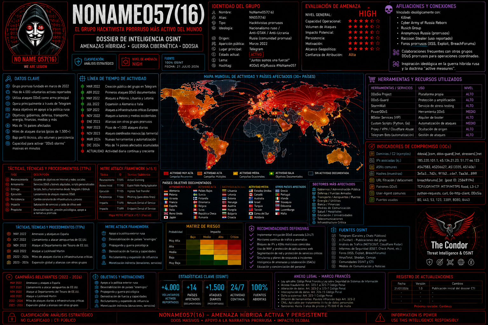
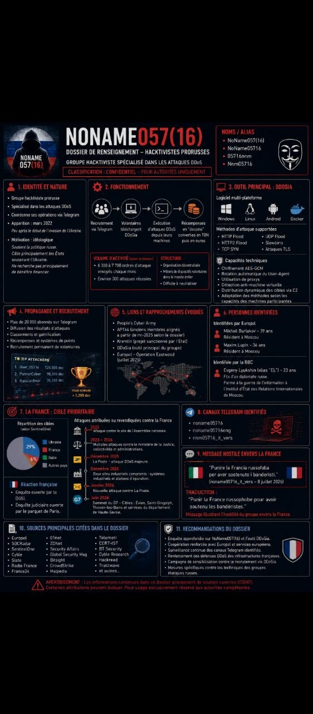

# 🕵️ NoName057(16) - Threat Intelligence Tracker


<p align="center">
  
</p>

**Repository Purpose:** Centralized Mapping & Tracking of the NoName057(16) Threat Actor Infrastructure  
**Classification:** TLP:WHITE  
**Status:** 🟢 Active Tracking (Updated: 2026-07-25)  



---

## NoName057(16): Beyond the Script Kiddies
### A Multifaceted Actor in Cyberwarfare

NoName057(16) is not just another hacker group. It is a **decentralized, ideologically motivated, and technically evolved network** that has transitioned from a marginal group of "script kiddies" to one of the most active persistent threats within the pro-Russian ecosystem.

Since its emergence in March 2022, days after the start of the Russian invasion of Ukraine, NoName057(16) has executed a **relentless campaign of DDoS attacks** against governments, critical infrastructure, and media outlets in over 32 countries. However, its true sophistication lies not solely in its technical capabilities, but in its **organizational model, propaganda machinery, and adaptive capacity**.
---



### 1. The Human Ecosystem: A Generational and Global Network

NoName057(16) operates with a **two-speed structure**:

- **A small core**: responsible for coding the DDoSia tool, maintaining C2 infrastructure, conducting open-source intelligence (OSINT) to identify targets, and managing Telegram channels.
- **A massive periphery of volunteers**: over 10,000 members who contribute resources to the DDoSia botnet, many of whom lack advanced technical skills, mobilized by patriotism, financial rewards, or simply a desire to "participate in the war" from their homes.

This mix of **"older men"** with experience in cyber operations and **"young kids"** who come and go, attracted by gamification and cryptocurrencies, creates an **ecosystem that is resilient and difficult to dismantle**. There is no declared leader, and decision-making is decentralized, complicating traditional strikes against the group's leadership.

---

### 2. DDoSia: The Weapon That Gamifies War

NoName057(16)'s operational success rests on **DDoSia**, its flagship project. Launched in July 2022, DDoSia is not traditional malware that infects machines without user knowledge. It is a **voluntary attack tool**:

- Anyone can download the software and join the attacks.
- Volunteers receive targets, commands, and updates via Telegram.
- Attacks are **rewarded with cryptocurrencies** (primarily TON coin), creating an army of "cyber-mercenaries."
- The project includes **leaderboards, points, and gamification** to foster competition.

**Technical evolution of DDoSia**: since 2022, it has gone through five major versions, incorporating:
- Encrypted C2 communications.
- User-Agent rotation and proxy usage.
- Anti-analysis and anti-VM techniques.
- Multiple attack vectors: HTTP/2 floods, SYN floods, UDP floods, Slowloris, TLS handshake exploitation.
- Support for Windows, Linux, Android, and Dockerized versions.

---

### 3. The Propaganda Machine: When the Attack Is Just the Medium

What truly sets NoName057(16) apart from other hacktivist groups is its **sophisticated propaganda operation**. They do not merely attack; they **construct a narrative** around their actions:

- **Framing attacks**: they present them as "self-defense" against Western aggression.
- **Telegram channels**: over 20,000 followers, with channels in Russian, English, and **Italian**. The Italian channel is not incidental: it seeks to directly influence Italian public opinion and recruit local followers.
- **Real-time "proof"**: they publish screenshots of downed sites as "evidence" of their success.
- **Visual propaganda**: they have used neural networks to create **cartoons** narrating their "travels" of attacks over the years, a qualitative leap in the visual communication of threats.

This propagandistic component turns each DDoS attack into an **act of political communication**. They seek not only to cause damage but to **be seen, be feared, and be legitimized** within their ecosystem.

---

### 4. Italy in the Crosshairs: A Continuous "Journey"

Italy is one of **NoName057(16)'s primary targets**. The group has executed multiple waves of attacks, always synchronized with political events:

- **March 2023**: attacks on ATAC, Ministry of Transport, Bologna Airport, Camera.it, Ministry of Defense, Ministry of Foreign Affairs.
- **May 2023**: during Zelensky's visit to Rome.
- **August 2023**: attack on 16 Italian banks, including Bper, Monte dei Paschi, Fineco.
- **February 2025**: on the third anniversary of the invasion, they attacked the servers of the **Veneto Region**, displaying the emblem of a bear with war gear.
- **December 2024**: attack on **Malpensa and Linate** airports, as well as the Farnesina.
- **Recurring attacks**: on Giorgia Meloni's personal website, ministries, the Guardia di Finanza.

Each attack is accompanied by a **clear political message**: "Italy is preparing a new military aid package for Ukraine. We remind Italian authorities of the consequences of helping Zelensky's criminal regime."

---

### 5. The Geopolitical Board: Synchronization with the Kremlin

NoName057(16) maintains **near-perfect synchronization** with Russia's geopolitical interests:

- Attacks are launched **24 to 72 hours** after relevant political events: NATO accessions, sanction announcements, military aid packages to Ukraine.
- They have been linked to a **Kremlin-established IT organization** and described as a "state-sanctioned project."
- They operate within the pro-Russian ecosystem alongside groups like Killnet, Xaknet, and the Cyber Army of Russia Reborn, although they **explicitly deny any association with Killnet**.

---

### 6. Conclusion: A Threat in Constant Evolution

NoName057(16) has proven to be **more than a group of occasional hacktivists**. Its capacity to:

- **Evolve technically** (DDoSia v1 to v5).
- **Maintain a decentralized and resilient structure**.
- **Gamify and monetize** voluntary participation.
- **Build a coherent propagandistic narrative**.
- **Synchronize its attacks with the geopolitical calendar**.

...makes it a **model of hybrid threat**: part digital military operation, part social movement, part propaganda machine.

As long as the war in Ukraine continues, NoName057(16) **will keep evolving**. Analysts project potential integrations of machine learning for adaptive attacks, expansion into IoT environments, and greater decentralization through blockchain. The war, for them, is a **video game in which everyone can play**. And they are winning.

## 📖 Introduction

This repository serves as a **public, structured threat intelligence tracker** for the cybercriminal and hacktivist group tracked as **NoName057(16)** (also associated with the **GreenSnow botnet**, **Emotet** syndicate, and **Killnet/Conti** tactical alliances).

The goal is to provide defenders, researchers, and incident responders with a **single source of truth** regarding this actor's infrastructure, malware payloads, tactics, techniques, and procedures (TTPs), and real-time operational telemetry.

*This is not a "doxxing" or offensive operations project. It is a defensive intelligence repository built for detection, prevention, and mitigation.*

---

## 🎯 Scope of Mapping

This repository will systematically map and document the following aspects of NoName057(16) operations:

### 1. Infrastructure (Network Topology)
- **Primary C2 Nodes:** IP addresses, ASNs (e.g., `AS210558`), and geolocation.
- **DNS Abuse:** Tracking the use of dynamic DNS services (specifically the massive abuse of `sslip.io`) and custom domain clusters (e.g., `d3d97e...com`).
- **Bulletproof Hosting:** Providers enabling the group's persistence (e.g., 1337 Services GmbH).
- **Fast-Flux Networks:** Subdomain generation algorithms and patterns used to evade blocklists.

### 2. Malware Arsenal (Payloads & Droppers)
- **Dropper Campaigns:** Excel (.xls / .xlsx) documents used as initial infection vectors (spear-phishing).
- **Core Payloads:** Banking trojans (Emotet / Dridex), loaders, and secondary stages.
- **Post-Exploitation Tools:** RATs (XWorm, SectopRAT, Quasar, NjRAT), stealer malware (Redline), and ransomware precursors.
- **File Hashes:** SHA256, MD5, and SHA1 of all identified malicious samples.

### 3. Telemetry & Operational Activity
- **Botnet Sizing:** Active bot counts, geographic distribution of compromised hosts (zombies).
- **DDoS Warm-up Analysis:** Monitoring baseline activity to predict imminent DDoS waves (coordinated with groups like Anon Sudan and Killnet).
- **Temporal Tracking:** Historical sighting volumes (daily, monthly, total) to identify infrastructure rotations.

### 4. TTPs & Campaign Correlation
- **MITRE ATT&CK Mapping:** Mapping observed behaviors to the MITRE framework.
- **Cross-Group Links:** Identifying overlaps with other threat clusters (Killnet, Conti, ITArmy, etc.).
- **Vulnerability Exploitation:** Tracking which CVEs the group is actively weaponizing (e.g., Fortinet SSL-VPN CVEs).

---

## 📂 Repository Structure

```
/
├── reports/                 # Full threat intelligence reports (PDF/MD)
│   └── 2026-07-25_CONDOR_NoName057_Initial.md
├── iocs/                    # Structured IoC lists (CSV, JSON, STIX)
│   ├── network_iocs.csv     # IPs, Domains, URLs
│   ├── host_iocs.csv        # File Hashes (SHA256)
│   └── yara_rules/          # Custom YARA rules for detection
├── telemetry/               # Andromeda dashboard snapshots
│   └── 2026-07-25_botnet_size.json
├── tools/                   # Helper scripts for IoC parsing/validation
│   └── ioc_validator.py
└── README.md                # This file
```

---

## 📊 Current Data Snapshot (As of 2026-07-25)

Based on initial ingestion from Andromeda Private Suite and VirusTotal Graph:

| Metric | Value |
| :--- | :--- |
| **Primary IP** | `45.154.98.101` (NL) |
| **Associated ASN** | AS210558 (1337 Services GmbH) |
| **Total Sightings** | 11,765 |
| **Active Botnet Size** | 24,484 IPs |
| **Linked Threat Clusters** | Killnet (43), Conti (21), ITArmy (20), Anon Sudan |
| **Key Payload Hashes** | `bb01a42f...` (Emotet), `3b215d18...` (Excel Dropper) |

> *For detailed analysis, see the full report in the `/reports` directory.*

---

## 🛡️ Ethical Guidelines & Responsible Use

This repository is maintained with strict adherence to ethical cybersecurity principles. By accessing or using this data, you agree to the following:

### 1. Defensive Purpose Only
All information provided here is intended **solely for defensive cybersecurity activities**, including:
- Threat detection and incident response.
- Network and endpoint hardening.
- Security awareness and training.
- Academic and industry research.

### 2. No Offensive Use
You **must not** use the data contained in this repository to:
- Launch attacks, DDoS, or scanning campaigns against any target.
- Perform unauthorized penetration testing or vulnerability assessments.
- Harass, dox, or physically threaten any individuals or entities.

### 3. Responsible Disclosure & Attribution
- If you identify new IoCs or TTPs related to NoName057(16), please **submit a pull request or open an issue** with verifiable evidence.
- When sharing this intelligence, maintain the **TLP:WHITE** classification and attribute the source appropriately.

### 4. Compliance with Laws
Users are solely responsible for ensuring their use of this data complies with all applicable local, national, and international laws and regulations.

### 5. No Guarantee of Completeness
This repository represents a **best-effort** tracking initiative. IoCs may become stale, and infrastructure may shift rapidly. Always validate indicators before implementing blocking measures.

---

## 🤝 How to Contribute

We welcome contributions from the cybersecurity community:

1. **Fork** the repository.
2. **Add** new IoCs, reports, or telemetry data with verifiable sources.
3. **Submit** a pull request detailing your findings.
4. **Open an issue** to report errors or suggest improvements.

---

## 📜 License

This project is licensed under the **MIT License** - see the [LICENSE](LICENSE) file for details.

*Data is provided "as is" without warranty of any kind.*

---

## 📬 Contact

- **Maintained By:** Condor2026 Threat Security - Andromeda Private Suite
- **Purpose:** Public Threat Intelligence Sharing

---

**Tracking the threat, one node at a time.**
```
